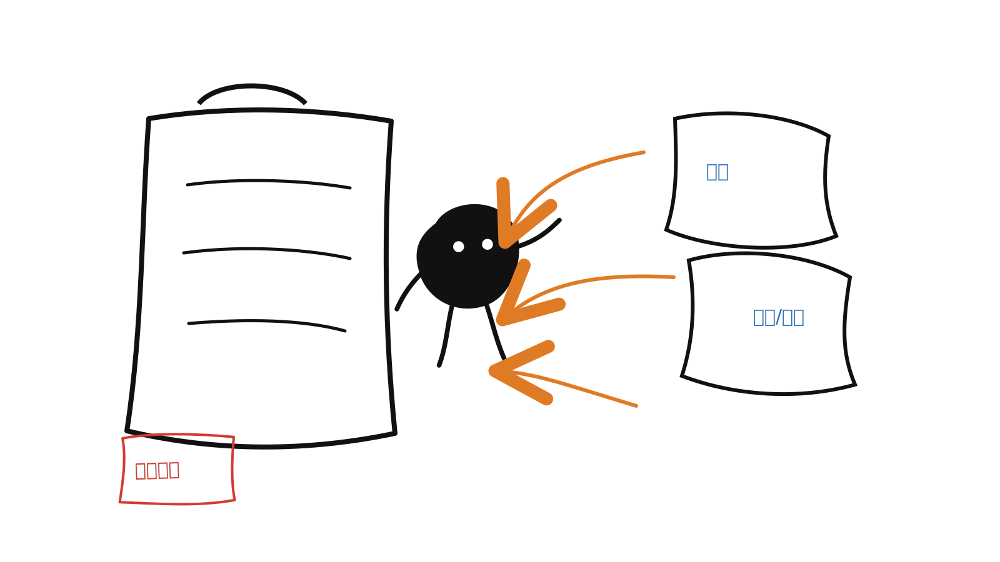
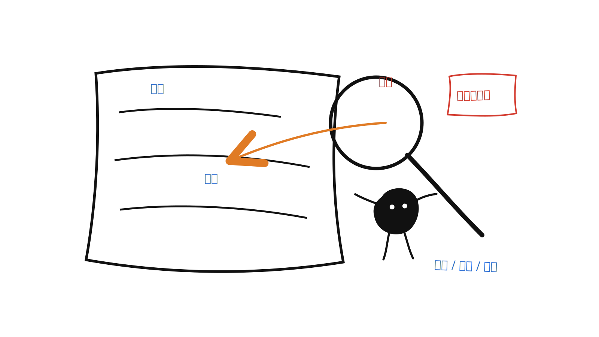
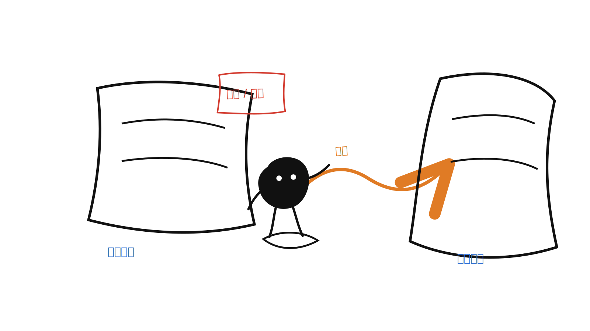
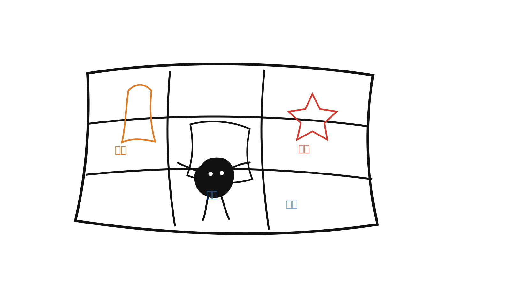
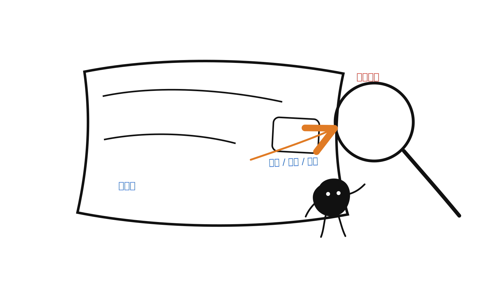
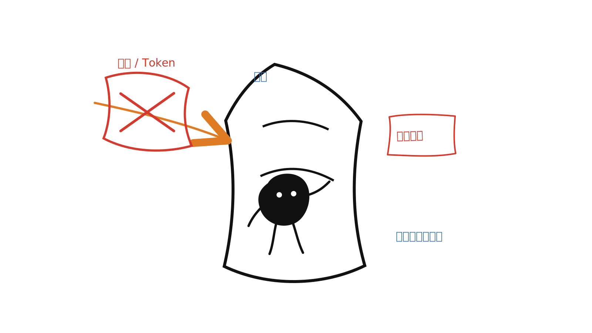
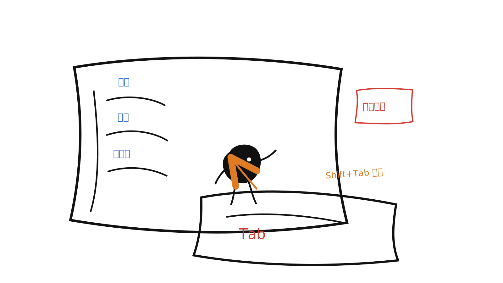
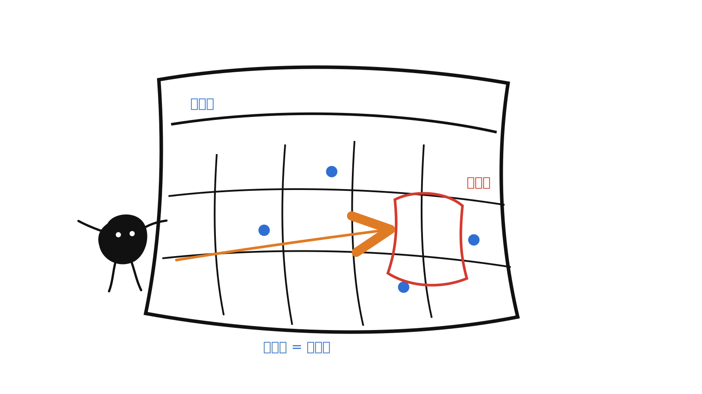
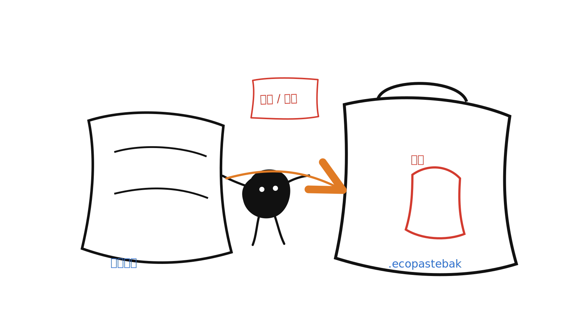
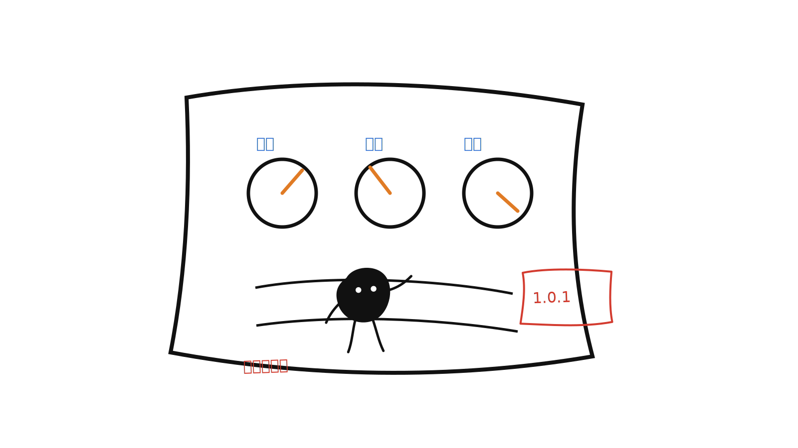

<div align="center">
  

  # EcoPasteProMax

  **适用于 macOS 与 Windows 的本地优先剪贴板管理器。**

  [English](./README.md) | 简体中文

  <br />

  
  
  
  
  
</div>

## 关于

EcoPasteProMax 是一个基于 EcoPaste Rust-First 重构版的开源桌面剪贴板管理器：持久化和系统侧能力优先由 Rust 承担，React 前端专注于界面展示与交互。

这次重构的目标是让应用更快、更轻、更易维护，并提供本地存储、SQLite 搜索、原生快捷键、托盘、备份，以及聚焦 macOS 与 Windows 的跨平台体验。

## 项目状态

当前本地构建版本为 `1.0.1`。

尝试这个版本前，请先备份旧版 EcoPaste 的重要数据。重构版调整了运行架构、设置模型、存储布局和数据库结构；除非明确提供迁移路径，否则不保证与旧版数据兼容。

## 平台范围

Rust-First 重构版仅支持 macOS 与 Windows。

旧版 EcoPaste 曾支持 Linux，但重构版已经放弃 Linux 支持，并且暂不计划重新支持 Linux。如果你需要 Linux 支持，请继续使用旧版发布线。

## 功能导览

### 剪贴板内容采集

EcoPasteProMax 会自动采集纯文本、HTML、RTF、图片、文件和文件夹等剪贴板内容，并把历史记录保存在本机，方便之后再次查找和复用。

<p align="center">
  
</p>

### 历史搜索与筛选

历史记录支持 SQLite FTS5 全文搜索，可以检索剪贴板正文和备注；也可以按来源应用、内容类型、自定义分组、收藏和日期缩小范围。

<p align="center">
  
</p>

### 快速复用内容

记录可以直接粘贴、复制、复制为纯文本、打开链接、定位文件，也可以拖出到其它应用，让常用内容不再反复翻找。

<p align="center">
  
</p>

### 内容管理

通过收藏、置顶、备注、自定义分组和可配置快捷动作，用户可以把临时记录、常用内容和重点资料分开整理。

<p align="center">
  
</p>

### 独立预览

文本、图片和文件记录可以在独立预览窗口中查看，先确认内容再粘贴，减少误选和重复打开文件的成本。

<p align="center">
  
</p>

### 隐私与安全

软件会识别并跳过高置信敏感内容，例如私钥、服务 Token、AWS Key 和 JWT，降低敏感信息被写入历史记录的风险。

<p align="center">
  
</p>

### 窗口与快捷键体验

可以通过快捷键呼出粘贴面板。当前面板将“全部”、“收藏”和用户自定义分组放在左侧边栏，并保留 Tab / Shift+Tab 的键盘筛选体验。

<p align="center">
  
</p>

### 日期筛选

日期筛选按月展示，有剪贴内容的日期会显示状态点；选择某一天后立即筛选对应历史记录，适合按时间找回内容。

<p align="center">
  
</p>

### 备份与迁移

支持导出和导入 `.ecopastebak` 备份文件，并支持加密备份，方便在重装、迁移或恢复时保留关键数据。

<p align="center">
  
</p>

### 设置与本地化

用户可以调整采集顺序、大小限制、保留策略、展示密度、列表排序、窗口行为、主题语言和系统入口，让软件贴合自己的使用方式。

<p align="center">
  
</p>

## 1.0.1 近期更新

- 粘贴面板将“全部”、“收藏”和用户自定义分组移动到软件图标下方的左侧边栏，并保持使用 Tab 在这些分组之间切换。
- “文本”、“图片”、“文件”筛选移动到右侧，与“更多”按钮区域对齐，并改为使用 Shift+Tab 在取消筛选、文本、图片、文件之间轮换。
- 面板呼出后默认进入“全部”，顶部搜索框加宽并向左调整，使其在软件图标和固定窗口按钮之间更均衡。
- 原分组/筛选区域改为日期筛选，下拉后按月显示，有剪贴内容的日期会显示状态点，单选日期后立即生效。
- 在“全部”状态下，收藏条目会显示右下角状态标记；同时置顶和收藏时，两个标记叠压显示。
- 设置页“关于”中的支持项改为“黑子特供版”，移除右侧二维码，并让该行高度与其它设置项一致。

## 架构

EcoPasteProMax 采用 Rust-First 的 Tauri 架构：

- `src-tauri/src/clipboard/` 负责剪贴板采集、内容识别、写回、来源应用、资源落盘和监听回环抑制。
- `src-tauri/src/db/` 负责 SQLite 仓储、模型、迁移和 FTS 搜索。
- `src-tauri/src/settings/`、`window/`、`shortcut/`、`tray/`、`menu/`、`autostart/` 和 `backup/` 负责原生能力与持久化应用状态。
- `src/` 包含 React UI、Ant Design 组件、UnoCSS 样式、Valtio UI/设置镜像、i18n 资源，以及类型化 Tauri command 封装。

前端通过 Tauri command 调用 Rust，并通过 `clipboard://updated`、`settings://updated`、`window://visibility` 等命名空间事件接收刷新信号。

## 技术栈

| 维度 | 选型 |
| --- | --- |
| 桌面外壳 | Tauri v2 |
| 前端 | React 19、Ant Design 6、UnoCSS `presetWind4` |
| 状态 | Valtio，仅用于 UI 状态与设置镜像 |
| 后端 | Rust、sqlx、SQLite |
| 构建 | Vite、pnpm |
| 质量 | Biome、TypeScript、rustfmt、clippy、cargo test |

## 开始开发

### 环境要求

- macOS 或 Windows。
- Node.js 20 或更高版本。
- pnpm 10 或更高版本。
- `rust-toolchain.toml` 指定的 Rust 工具链（`1.96.0`，包含 `rustfmt` 和 `clippy`）。
- Tauri v2 所需的系统原生依赖。请参考 [Tauri prerequisites](https://tauri.app/start/prerequisites/) 中对应系统的说明。

### 安装依赖

```bash
pnpm install
```

### 开发运行

```bash
pnpm tauri dev
```

### 构建

```bash
pnpm tauri build
```

## 质量检查

前端：

```bash
pnpm lint
pnpm tsc
```

Rust：

```bash
cd src-tauri
cargo fmt
cargo clippy -- -D warnings
cargo test
```

格式化前端文件：

```bash
pnpm format
```

## 仓库结构

```text
src-tauri/
  src/
    commands/    # Tauri command 入口
    clipboard/   # 剪贴板读写、采集、识别、存储
    db/          # SQLite 仓储、模型、迁移
    settings/    # 设置模型与持久化
    window/      # 窗口状态、定位、生命周期
    shortcut/    # 全局快捷键
    tray/        # 托盘菜单
    menu/        # 列表项右键菜单
    backup/      # 备份导入导出
    i18n/        # Rust 侧用户可见文案
  migrations/
src/
  commands/      # 类型化 Tauri invoke 封装
  components/    # 共享 React 组件
  constants/     # 跨层复用常量镜像
  hooks/         # 共享 hooks
  locales/       # zh-CN 和 en-US 翻译
  pages/         # Clipboard、Preference、Preview、ContextMenu
  stores/        # Valtio UI 状态与设置镜像
  types/         # TypeScript 契约镜像
```

## 参与贡献

修改代码前请先阅读 [AGENTS.md](./AGENTS.md)。它是本重构版架构边界、平台范围、编码规范和质量要求的单一真相源。

涉及下个版本的用户可见能力变更时，请同步更新 [RELEASE-NEXT.md](./RELEASE-NEXT.md)。文档内容也应与当前版本状态和受支持平台保持一致。

## 开源协议

EcoPasteProMax 基于 [Apache License 2.0](./LICENSE) 开源。
